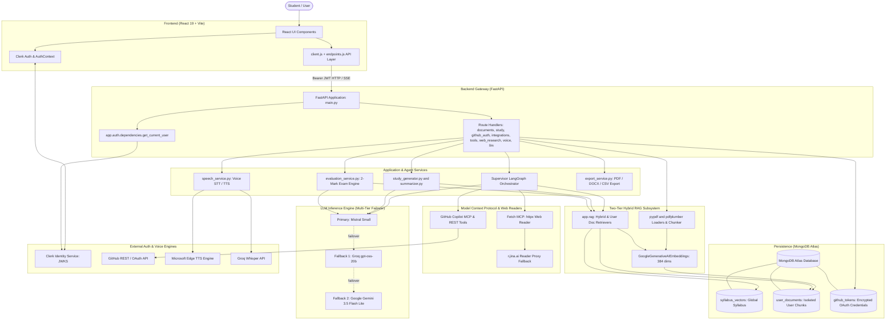
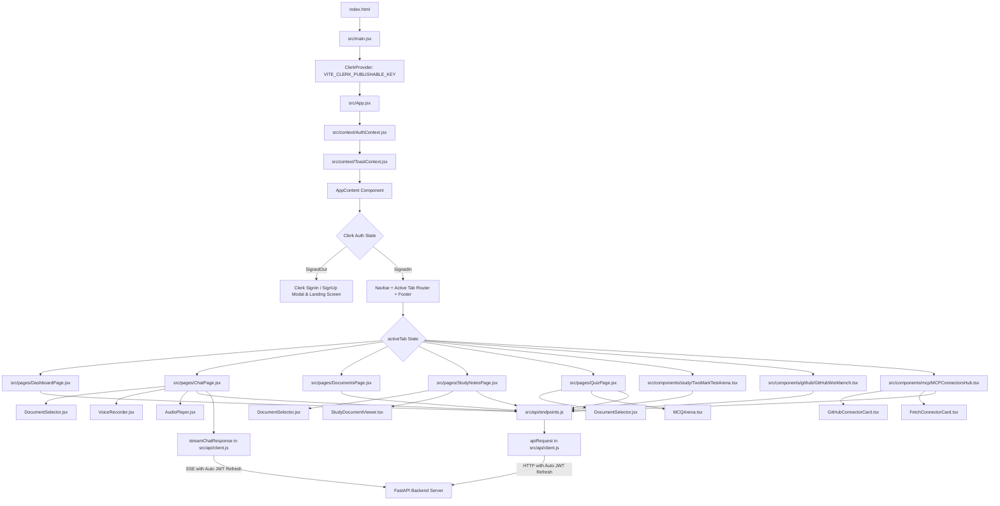
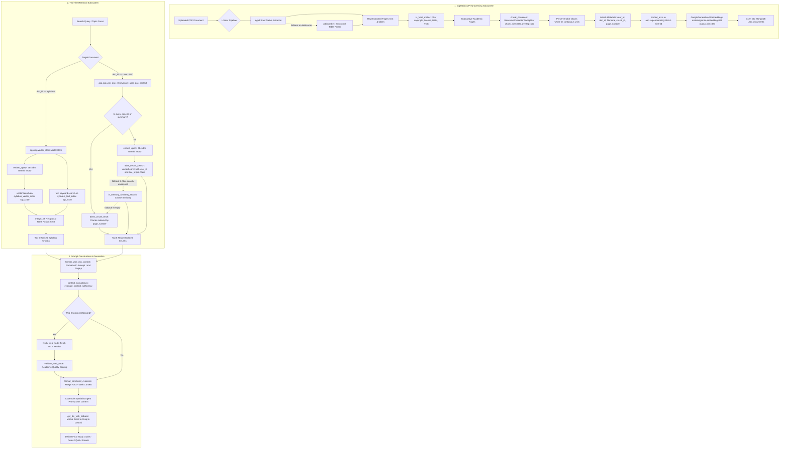
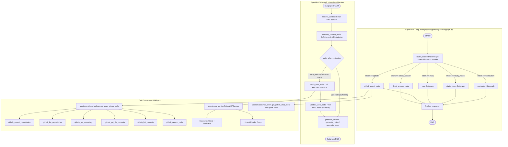
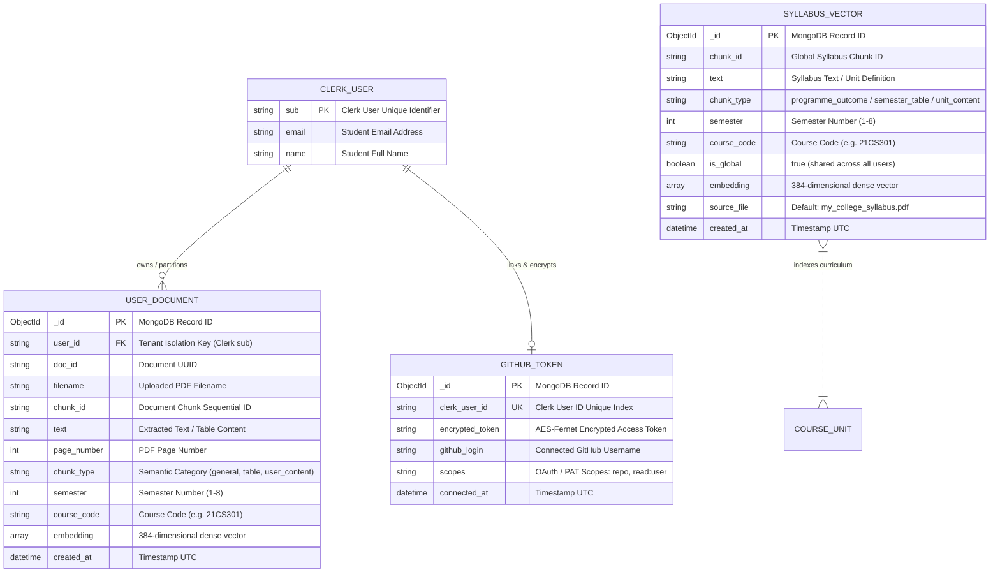
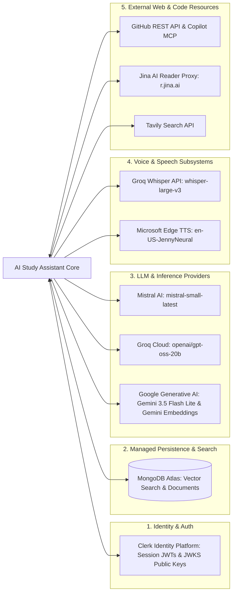
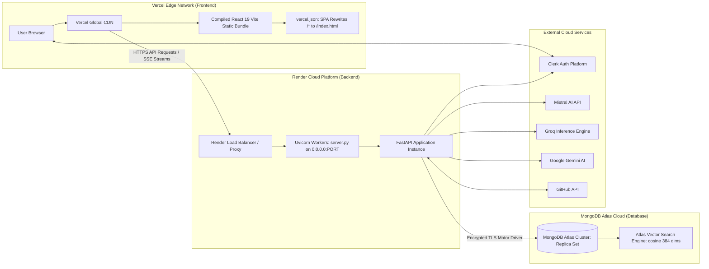

# AI Study Assistant — System Architecture Documentation

This document provides a comprehensive technical breakdown of the architectural patterns, components, schemas, and design decisions implemented in the **AI Study Assistant (StudySync AI)** repository.

---

## 1. Architecture Overview

The application is engineered as a **Decoupled Client-Server Architecture** augmented with **Multi-Agent Orchestration (LangGraph)**, a **Two-Tier Hybrid RAG Subsystem**, and external **Model Context Protocol (MCP)** integrations.

### Key Architectural Pillars:
1. **Frontend Presentation Layer**: Built with React 19 and Vite. Utilizes an unopinionated CSS design-token system, React Context for state and toast management, Clerk for identity lifecycle control, and real-time Server-Sent Events (SSE) streaming for chat tokens.
2. **API & Service Gateway**: Asynchronous FastAPI service running on Uvicorn. Exposes RESTful endpoints, streaming interfaces, static file serving, and global error handling with validation handlers.
3. **Agentic Orchestration Layer**: Powered by LangGraph. Employs a **Supervisor Agent** that dynamically routes queries across specialized subgraphs:
   - **Curriculum Agent**: Answers university syllabus, course code, and credit distribution questions.
   - **StudyNotes Agent**: Synthesizes high-yield structured notes and conceptual cheat sheets.
   - **MCQ Agent**: Generates calibrated multiple-choice quizzes with options and explanations.
   - **GitHub Agent**: Interacts with student repositories, inspects file contents, and performs automated code reviews.
   - **Direct Answer Agent**: Directly answers general knowledge and conversational inquiries.
4. **Two-Tier Hybrid Retrieval-Augmented Generation (RAG)**:
   - **Tier 1 (Global Syllabus)**: Shared curriculum documents indexed in `syllabus_vectors` using Reciprocal Rank Fusion (RRF) between dense Atlas Vector Search and sparse BM25 text search.
   - **Tier 2 (Tenant-Isolated Student Uploads)**: Arbitrary lecture slides and textbooks indexed in `user_documents` partitioned strictly by `user_id`.
5. **Model Context Protocol (MCP) & Web Enrichment**:
   - **Fetch MCP**: Dynamically pulls live web documentation, strips boilerplate, validates academic quality, and injects external evidence into RAG prompts.
   - **GitHub MCP & REST Tools**: Securely reads user repositories and commits via AES-Fernet encrypted access tokens.
6. **Resilient LLM Provider Layer**: Primary inference via Mistral Small (`mistral-small-latest`), with automatic multi-tier fallback to Groq (`openai/gpt-oss-20b`) and Google Gemini (`gemini-3.5-flash-lite`).

---

## 2. High-Level Architecture Diagram

---

## 3. Frontend Architecture Diagram

---

## 4. Backend Architecture Diagram

```mermaid
flowchart TD
    ServerRunner["server.py: Auto venv detection & port binding"] --> MainApp["app/main.py: FastAPI Application"]
    
    MainApp --> Lifespan["app.main.lifespan: Startup / Shutdown Context"]
    Lifespan --> MongoConn["connect_to_mongo: AsyncIOMotorClient & Index Init"]
    
    MainApp --> MiddlewareLayer["FastAPI Middleware & Exception Handlers"]
    MiddlewareLayer --> CORSMiddleware["CORSMiddleware: Origins localhost 3000/5173, Vercel"]
    MiddlewareLayer --> ValidationHandler["validation_exception_handler: RequestValidationError"]
    MiddlewareLayer --> StaticMount["StaticFiles Mount: /outputs"]
    
    MainApp --> IncludedRouters["Included APIRouters"]
    IncludedRouters --> R_Docs["app.routes.documents: /api/documents"]
    IncludedRouters --> R_Study["app.routes.study: /api/study"]
    IncludedRouters --> R_GHAuth["app.routes.github_auth: /auth/github"]
    IncludedRouters --> R_Integrations["app.routes.integrations: /api/integrations"]
    IncludedRouters --> R_Tools["app.routes.tools: /api/tools"]
    IncludedRouters --> R_Web["app.routes.web_research: /api/web"]
    IncludedRouters --> R_Voice["app.routes.voice: /api/voice"]
    IncludedRouters --> R_LLM["app.routes.llm: /api/chat/*, /chatbot"]
    IncludedRouters --> R_StudyGuide["app.study_guide.router: /study-guide/upload"]
    
    R_Docs --> AuthDependency["app.auth.dependencies.get_current_user"]
    R_Study --> AuthDependency
    R_GHAuth --> AuthDependency
    R_Integrations --> AuthDependency
    R_Tools --> AuthDependency
    R_Web --> AuthDependency
    R_LLM --> AuthDependency

    AuthDependency --> ClerkVerifier["app.auth.clerk.verify_clerk_token: RS256 JWKS Cache"]
    
    R_LLM --> ChatCoordinator["app.ai.chat_service.ChatService: LangGraph Invocation"]
    R_Study --> ChatCoordinator

    ChatCoordinator --> SupervisorGraph["app.ai.agents.supervisor.graph.get_supervisor_graph"]
    
    R_Study --> DirectStudyGen["app.services.study_generator"]
    R_Study --> EvalService["app.services.evaluation_service"]
    R_Study --> ExportService["app.services.export_service"]
    R_StudyGuide --> MapReduceSummarizer["app.study_guide.summarizer & mcq_generator"]
    R_Voice --> SpeechService["app.services.speech_service"]
    
    R_Docs --> UserDocService["app.rag.user_doc_service"]
    ChatCoordinator --> RAGModule["app.rag: user_doc_retriever & vector_store"]
    DirectStudyGen --> RAGModule
    EvalService --> RAGModule
    
    RAGModule --> MongoModule["app.db.mongodb: AsyncIOMotorClient"]
    R_GHAuth --> TokenStoreModule["app.db.token_store: Fernet Encrypted Storage"]
    R_Integrations --> TokenStoreModule
```

---

## 5. RAG Architecture Diagram

---

## 6. Agent & Tool Architecture Diagram

---

## 7. Data Architecture Diagram

---

## 8. API Architecture Table

The following table documents all **37 endpoints** implemented across the FastAPI routers:

| HTTP Method | Endpoint Path | Description / Purpose | Authentication | Service / Handler Function |
|---|---|---|---|---|
| `GET` | `/` | API service landing message | Public | `app.main.landing_page` |
| `GET` | `/health` | Health diagnostic & LangSmith tracing status | Public | `app.main.health_check` |
| `POST` | `/api/documents/upload` | Upload & ingest user PDF (max 50MB, 50 pages) | Required (Clerk JWT) | `app.routes.documents.upload_document` |
| `GET` | `/api/documents` | List uploaded documents for current user | Required (Clerk JWT) | `app.routes.documents.list_user_documents` |
| `DELETE` | `/api/documents/{doc_id}` | Delete user document and all indexed chunks | Required (Clerk JWT) | `app.routes.documents.delete_user_document` |
| `POST` | `/api/study/topic-notes` | Generate structured TopicStudyNotes | Required (Clerk JWT) | `app.routes.study.generate_topic_notes` |
| `POST` | `/api/study/notes` | Generate AdaptiveStudyNotes via LangGraph | Required (Clerk JWT) | `app.routes.study.generate_notes` |
| `GET` | `/api/study/export-notes` | Direct query-based PDF/DOCX file export | Required (Clerk JWT) | `app.routes.study.export_study_notes` |
| `POST` | `/api/study/export/pdf` | Export notes payload as ReportLab PDF | Required (Clerk JWT) | `app.routes.study.export_pdf` |
| `GET` | `/api/study/download/pdf`| GET download notes PDF | Required (Clerk JWT) | `app.routes.study.download_pdf_get` |
| `POST` | `/api/study/export/docx` | Export notes payload as Word (.docx) | Required (Clerk JWT) | `app.routes.study.export_docx` |
| `GET` | `/api/study/download/docx`| GET download notes DOCX | Required (Clerk JWT) | `app.routes.study.download_docx_get` |
| `POST` | `/api/study/mcq` | Generate multiple-choice quiz questions | Required (Clerk JWT) | `app.routes.study.generate_mcqs` |
| `POST` | `/api/study/generate-pack`| Generate comprehensive study pack (notes, 20 MCQs, 5 short answers, glossary) | Required (Clerk JWT) | `app.routes.study.generate_pack` |
| `POST` | `/api/study/export-pack/pdf` | Export full study pack as ReportLab PDF | Required (Clerk JWT) | `app.routes.study.export_pack_pdf` |
| `POST` | `/api/study/export-pack/csv` | Export 20 MCQs as Anki-compatible CSV | Required (Clerk JWT) | `app.routes.study.export_pack_csv` |
| `POST` | `/api/study/generate-test`| Generate university Part-A (2-mark) test | Required (Clerk JWT) | `app.routes.study.generate_test` |
| `POST` | `/api/study/evaluate-answer`| Semantically evaluate student 2-mark answer | Required (Clerk JWT) | `app.routes.study.evaluate_answer` |
| `POST` | `/study-guide/upload` | Ad-hoc Map-Reduce PDF summarization & MCQs | Public | `app.study_guide.router.upload_study_guide_document` |
| `GET` | `/auth/github/login` | Initiate GitHub OAuth web redirect | Required (Clerk JWT) | `app.routes.github_auth.github_login` |
| `GET` | `/auth/github/callback` | OAuth redirect callback handler (HTML/JSON) | Public (State-bound) | `app.routes.github_auth.github_callback_get` |
| `GET` | `/auth/github/status` | Check if user has active GitHub connection | Required (Clerk JWT) | `app.routes.github_auth.github_status` |
| `POST` | `/auth/github/disconnect` | Revoke grant and delete GitHub token | Required (Clerk JWT) | `app.routes.github_auth.github_disconnect` |
| `GET` | `/api/integrations/status`| Return integration status (GitHub, Fetch MCP) | Required (Clerk JWT) | `app.routes.integrations.get_integration_status` |
| `GET` | `/api/integrations/health`| Health diagnostic for MCP tool connectors | Required (Clerk JWT) | `app.routes.integrations.get_integrations_health` |
| `POST` | `/api/integrations/github`| Save & encrypt GitHub Personal Access Token | Required (Clerk JWT) | `app.routes.integrations.save_github_pat` |
| `DELETE` | `/api/integrations/github`| Disconnect GitHub PAT integration | Required (Clerk JWT) | `app.routes.integrations.delete_github_integration` |
| `GET` | `/api/tools/fetch-url` | Proxy fetch external doc to clean Markdown | Required (Clerk JWT) | `app.routes.tools.fetch_url_get` |
| `POST` | `/api/tools/fetch-url` | Proxy fetch external doc via JSON body | Required (Clerk JWT) | `app.routes.tools.fetch_url_post` |
| `POST` | `/api/web/fetch` | Fetch MCP clean article extraction | Required (Clerk JWT) | `app.routes.web_research.fetch_webpage` |
| `POST` | `/api/web/ask` | Q&A grounded in fetched web article | Required (Clerk JWT) | `app.routes.web_research.ask_webpage_question` |
| `POST` | `/api/web/notes` | Synthesize study notes from web article | Required (Clerk JWT) | `app.routes.web_research.generate_web_study_notes` |
| `POST` | `/api/voice/transcribe` | Audio speech-to-text via Groq Whisper | Public | `app.routes.voice.transcribe` |
| `POST` | `/api/voice/synthesize` | Text-to-speech audio stream via Edge TTS | Public | `app.routes.voice.synthesize` |
| `POST` | `/api/chat/stream` | Real-time SSE token-streaming chat | Required (Clerk JWT) | `app.routes.llm.chat_stream` |
| `POST` | `/api/chat/message` | Synchronous direct chat message execution | Required (Clerk JWT) | `app.routes.llm.chat_message` |
| `POST` | `/chatbot` | Legacy health / echo endpoint | Public | `app.routes.llm.chatbot` |

---

## 9. External Services Architecture

---

## 10. Security Architecture

```mermaid
flowchart TD
    subgraph InboundSecurity ["1. Inbound Network & Auth Security"]
        Req["Client Request"] --> CORS["CORS Middleware: Strict Origin Whitelist & Regex"]
        CORS --> RateLimitCheck["Input Sanitization & Buffer Size Limit: 50MB"]
        RateLimitCheck --> AuthDep["HTTPBearer: get_current_user Dependency"]
        AuthDep --> JWKS["Clerk RS256 Verification with In-Memory Key Cache 1hr"]
    end

    subgraph TokenEncryption ["2. Credentials Encryption (At Rest)"]
        GH_Token["Student GitHub OAuth Token / PAT"] --> FernetKey["TOKEN_ENCRYPTION_KEY: 256-bit AES Fernet"]
        FernetKey --> EncryptedString["Encrypted Ciphertext Stored in MongoDB github_tokens"]
        EncryptedString --> DecryptOnDemand["Decrypted in memory ONLY during active tool calls"]
    end

    subgraph TenantIsolation ["3. Tenant Boundary Enforcement"]
        DecodedUser["current_user sub"] --> DocTag["Stamp all uploaded chunks with user_id"]
        DecodedUser --> RAGFilter["Hard Filter: user_id = current_user.sub and doc_id = doc_id"]
        RAGFilter --> PreventLeakage["Cross-tenant data access strictly impossible"]
    end

    subgraph SSRFProtection ["4. Web Reader SSRF Defense"]
        TargetURL["External Web URL"] --> URLValidator["validate_public_url in web_content_service.py"]
        URLValidator --> IPBlock["Block localhost, 127.0.0.1, private RFC-1918 subnets, cloud metadata"]
        URLValidator --> SchemeCheck["Enforce HTTP / HTTPS scheme only"]
    end
```

---

## 11. Deployment Architecture

