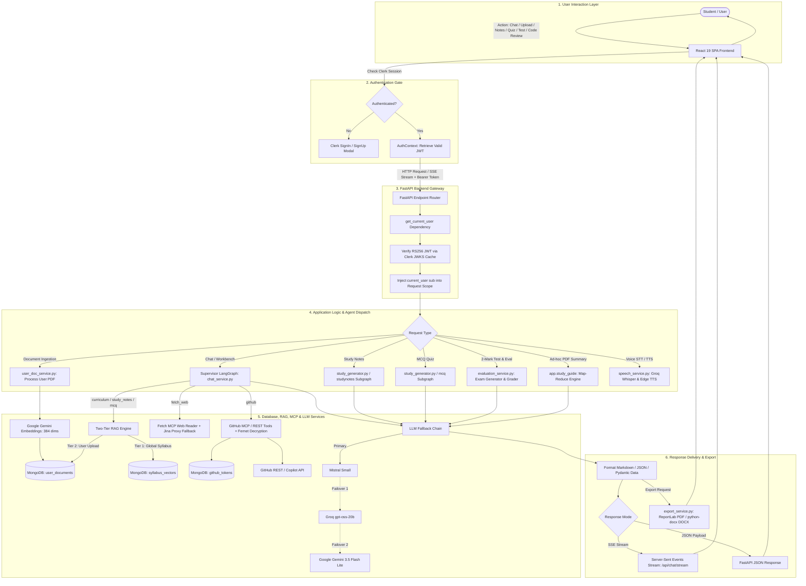
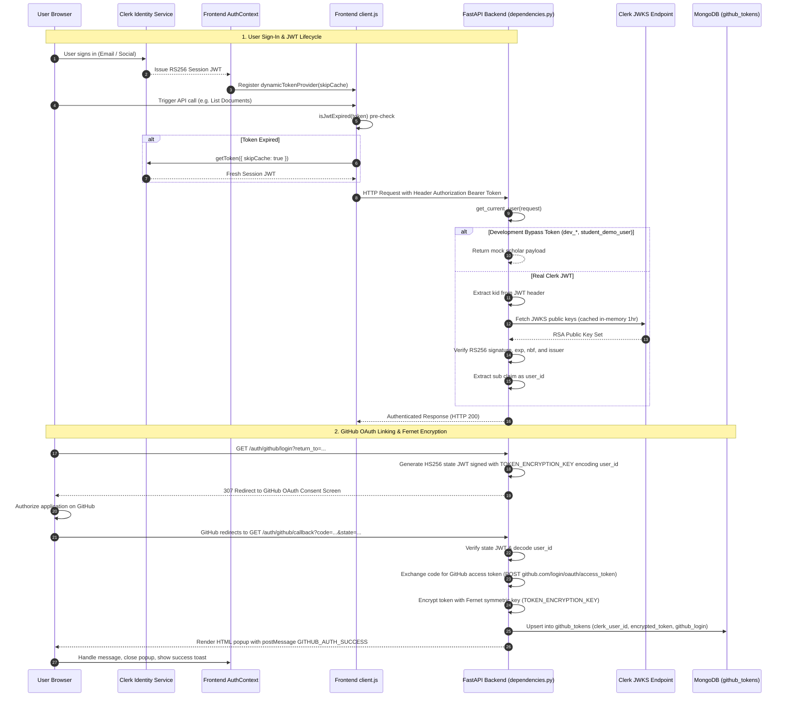
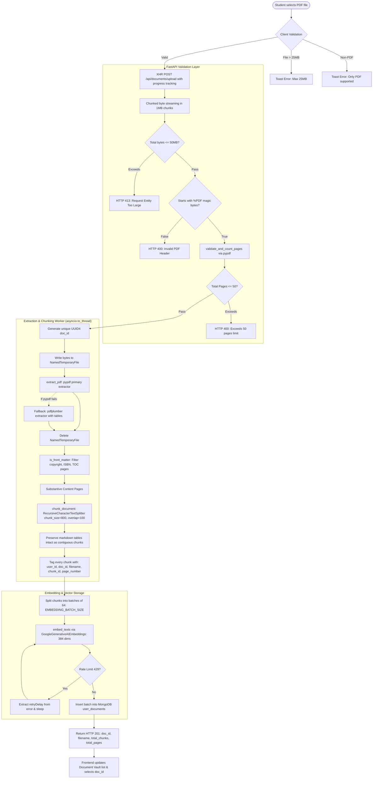
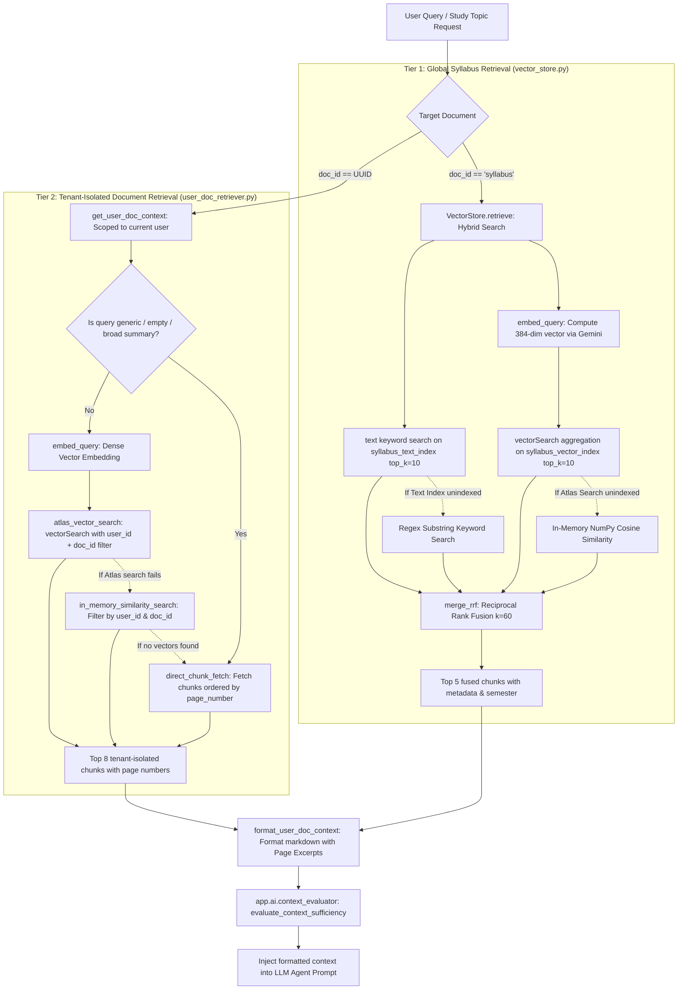
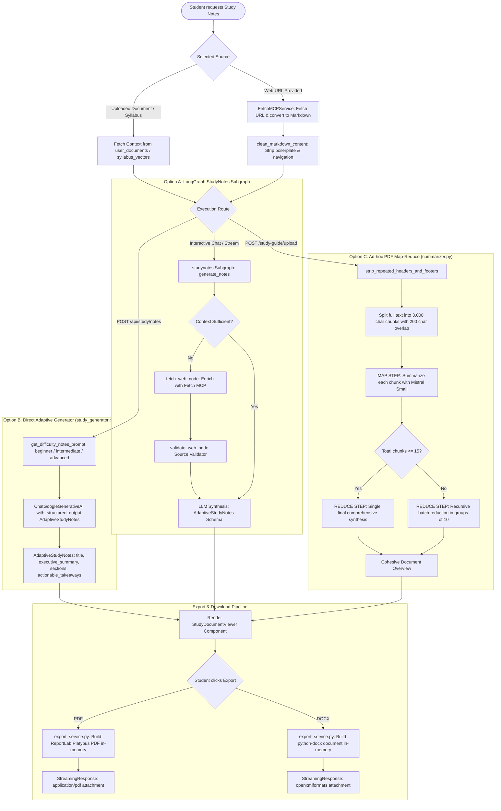
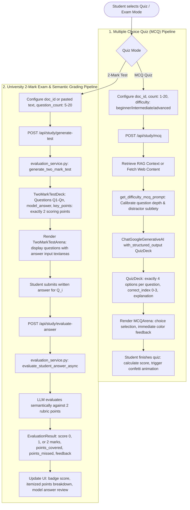
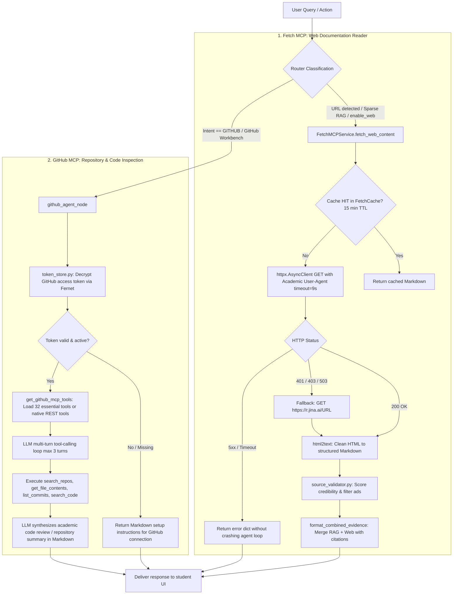
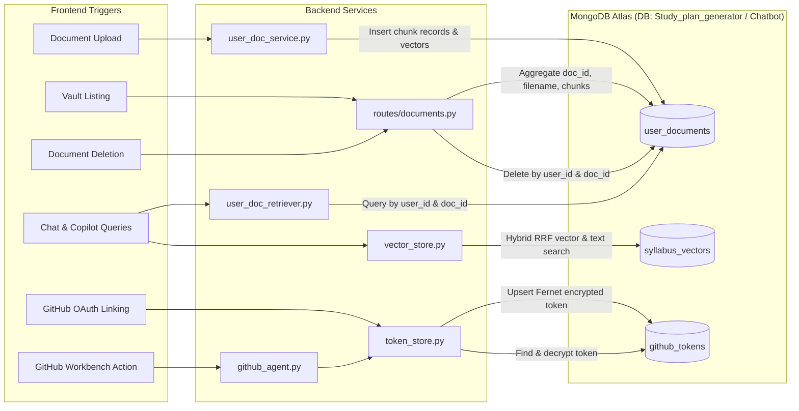
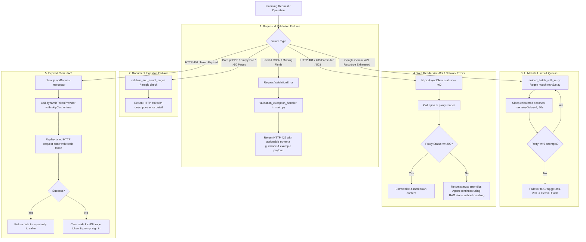

# AI Study Assistant — System Workflow Documentation

This document describes the end-to-end execution workflows of the **AI Study Assistant (StudySync AI)** application based on the actual implementation in the codebase.

---

## 1. Application Overview

**AI Study Assistant (StudySync AI)** is a full-stack, university-tailored curriculum and study copilot. The platform enables engineering students to:
- Navigate course syllabi, curriculum regulations, and credit distributions.
- Synthesize structured, high-yield academic study notes calibrated by academic difficulty (`beginner`, `intermediate`, `advanced`).
- Practice with calibrated multiple-choice questions (MCQs) featuring instant feedback, distractors, and conceptual explanations.
- Generate and evaluate university Part-A (2-mark) conceptual exams with automated semantic grading (0, 1, or 2 marks) against scoring rubrics.
- Upload and index personal lecture slides, question banks, and textbook PDFs up to 50MB/50 pages in an isolated vector knowledge vault.
- Inspect student GitHub repositories, browse source files, check commits, and run automated code reviews via GitHub Model Context Protocol (MCP) and REST tools.
- Read live external web documentation and synthesize study guides via Fetch MCP with automated boilerplate stripping.
- Interact via voice using Groq Whisper speech-to-text (STT) and Microsoft Edge TTS neural voice playback.

---

## 2. Complete System Workflow

The complete end-to-end workflow connects student actions in the React frontend through Clerk authentication, FastAPI gateway dispatch, LangGraph multi-agent orchestration, the two-tier RAG retrieval pipeline, multi-provider LLM failover, and dynamic document generation.

---

## 3. User Authentication Workflow

The application secures all operations using **Clerk** session tokens and **AES-Fernet** encrypted OAuth linking for GitHub.

---

## 4. Document Upload & Ingestion Workflow

Student PDFs are ingested through a strict validation, extraction, chunking, and embedding pipeline into tenant-isolated storage.

---

## 5. RAG Retrieval Workflow

The system provides a **Two-Tier Hybrid RAG Architecture** with automatic fallback mechanisms.

---

## 6. Study Guide Generation Workflow

Study guides are synthesized either through the LangGraph `study_notes` subgraph, the direct adaptive study generator, or the Map-Reduce full document summarizer.

---

## 7. Quiz & MCQ Workflow

Multiple-choice quizzes and 2-mark conceptual exams are generated, displayed interactively, and semantically evaluated.

---

## 8. Model Context Protocol (MCP) Workflow

The system incorporates two distinct MCP integrations: **Fetch MCP** (web extraction) and **GitHub MCP** (code and repo operations).

---

## 9. Database Interaction Workflow

The following diagram illustrates which backend components interact with each MongoDB Atlas collection.

---

## 10. Error Handling & Fallback Workflow

The application employs defensive fallback mechanisms to ensure 100% uptime and graceful degradation.

